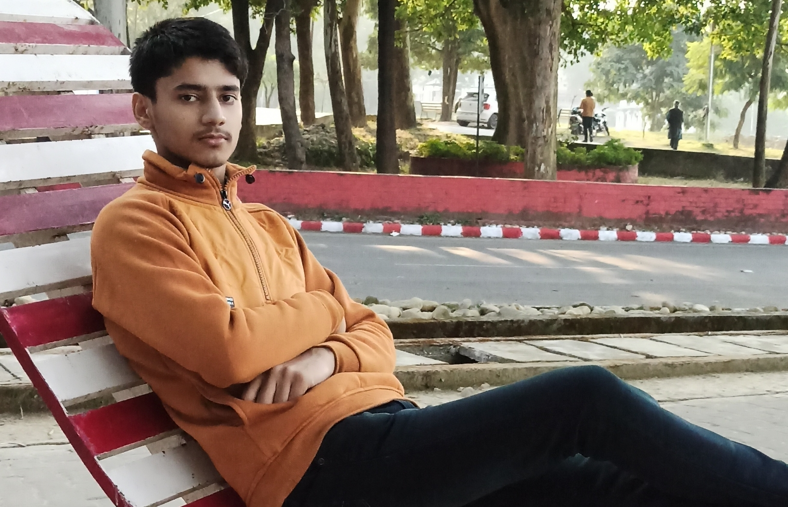

# Sarthak Choudhary

---
I am **Sarthak Choudhary**.  
I am a student pursuing *engineering*.  
I am from *Roorkee, Uttarakhand*, a place well know for **IIT Roorkee**.  
I love to spend my time on laptop *programming or designing 3D stuff*.

---
## Education
| Year of Graduation | Degree | Institution |
| :----------------: | :----: | :---------- |
| 2025 | B. Tech | Indian Institute of Technology Goa |
| 2020 | 12th standard | Shemford School Roorkee |
| 2018 | 10th standard | Shemford School Roorkee |
---

## 1st Year Courses @ IIT Goa
### Autumn 2021-2022
- [**CS101**: Introduction to Computing by Dr. Clint P. George](https://clintpgeorge.github.io/cs-101/autumn-2021/ "CS101 Webpage")
- **CH101**: Physical Chemistry
- **CH102**: Inorganic and Organic Chemistry by *Rishikesh Narayan*
- **CH104**: Chemistry Lab II
- **CS100**: Introdution to Profession
- **HS101**: Foundation Programme in Humanities and Social Sciences by *Sabiha Hashami*
- **MTH101**: Calculus by *Sandipan De*
- **NO101**: National Sports Organisation
- **PH101**: Quantum Phyics and applications by *Sudipta Kanungo*
- **ELPP**: English Language Proficiency Program by *Neeraja Raghavan*

### Spring 2021-2022
1. *BIO101*: Introductory Biology
2. [*CS102*: Software Tools by <u>Dr. Clint P. George</u>](https://clintpgeorge.github.io/cs-102/spring-2022/ "CS102 Webpage")
3. *EE101*: Introduction to Electrical and Electronics Engineering
4. *ME102*: Engineering Graphics and Introduction to Computer Aided-Drawing</li>
5. *MTH1021*: Basic Linear Algebra</li>
6. *MTH1022*: Ordinary Differential Equations</li>
7. *NO102*: National Sports Organisation</li>
8. *PH102*: Electricity and Magnetism</li>
9. *PH104*: Physics Lab II

---